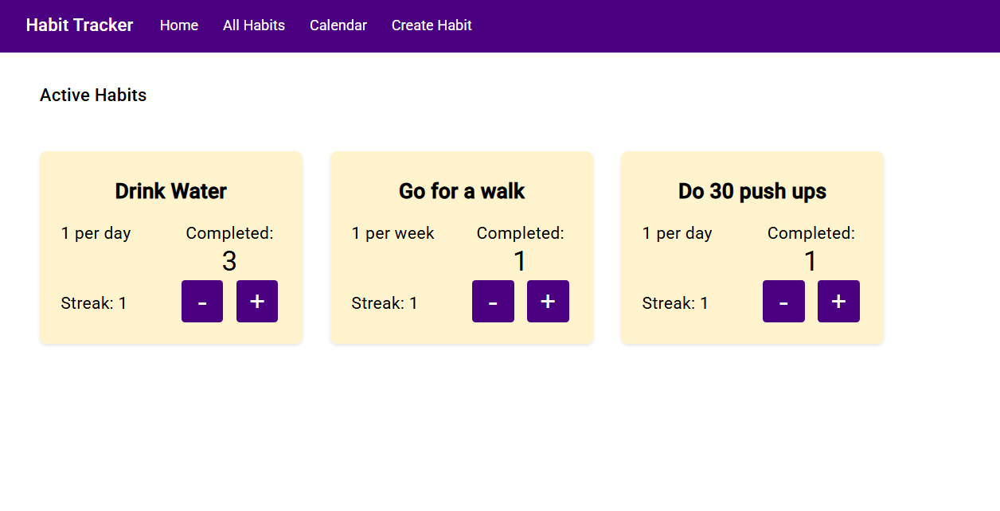
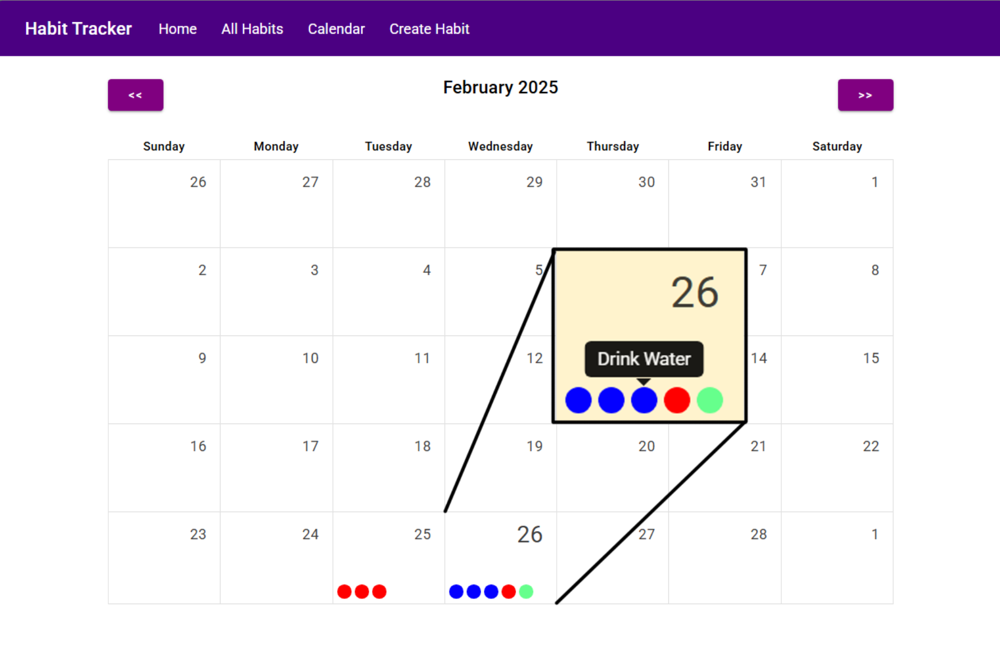
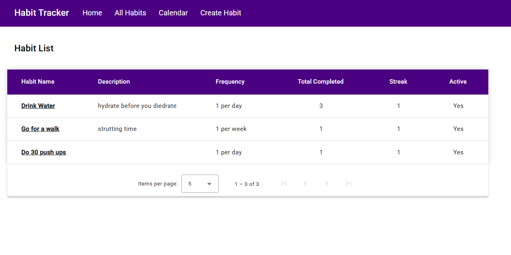

# Habit Tracker Web App

## Overview

The Habit Tracker Web App is a web application built using **C# and ASP.NET Core** for the backend and **Angular** for the frontend. It allows users to create, manage, and track their habits over time. The app includes features such as a dashboard for active habits, tracking streaks, and a calendar view to visualize habit completion.

## Features

- **Dashboard**: Displays active habits where users can adjust progress.
- **Habit Management**: Create, edit, and delete habits.
- **Progress Tracking**: Log habit completions and track streaks.
- **Calendar View**: Visual representation of habit completion for the month.
- **Customization**: Users can assign colors to habits.
- **Pagination & Sorting**: Display habits in a paginated table with sorting options.

## Technologies Used

### Backend:

- **C# & ASP.NET Core**
- **Entity Framework Core**
- **SQL Server**

### Frontend:

- **Angular**
- **Angular Material**
- **angular-calendar**

## Screenshots

| Dashboard |
|:-------------:|
|  |

| Calendar View |
|:-------------:|
|  |

| Habit List |
|:-------------:|
|  |

## Setup Instructions

### Prerequisites:

- .NET SDK
- Node.js & npm
- Angular CLI
- SQL Server

### Backend Setup:

1. Clone the repository:
   ```sh
   git clone https://github.com/yourusername/habit-tracker.git
   cd habit-tracker/backend
   ```
2. Install dependencies:
   ```sh
   dotnet restore
   ```
3. Set up the database:
   ```sh
   dotnet ef database update
   ```
4. Run the backend:
   ```sh
   dotnet run
   ```

### Frontend Setup:

1. Navigate to the frontend directory:
   ```sh
   cd ../frontend
   ```
2. Install dependencies:
   ```sh
   npm install
   ```
3. Run the Angular app:
   ```sh
   ng serve
   ```
4. Open the browser and navigate to `http://localhost:4200/`


## API Endpoints

### Habits
#### Get all habits - Retrieves a list of all habits.
```
GET /api/habits
```

#### Get a habit by ID - Retrieves a single habit by its ID.
```
GET /api/habits/{id}
```

#### Create a new habit - Creates a new habit. Requires a JSON body with habit details.
```
POST /api/habits
```

#### Update an existing habit - Updates an existing habit based on its ID.
```
PUT /api/habits/{id}
```

#### Delete a habit - Deletes a habit based on its ID.
```
DELETE /api/habits/{id}
```

### Habit Completion
#### Get habit completions - Retrieves a list of habit completions for the specified month and year.
```
GET /api/habits/habit-completions?month={month}&year={year}
```

### Progress Tracking
#### Update habit progress
```
PUT /api/habits/UpdateProgress/{id}
```
Updates progress for a habit. Requires a JSON body:
```json
{
  "Increment": true/false
}
```
- **true**: Increments total completed, updates streaks, and logs completion.
- **false**: Decrements total completed and removes the most recent completion log.

